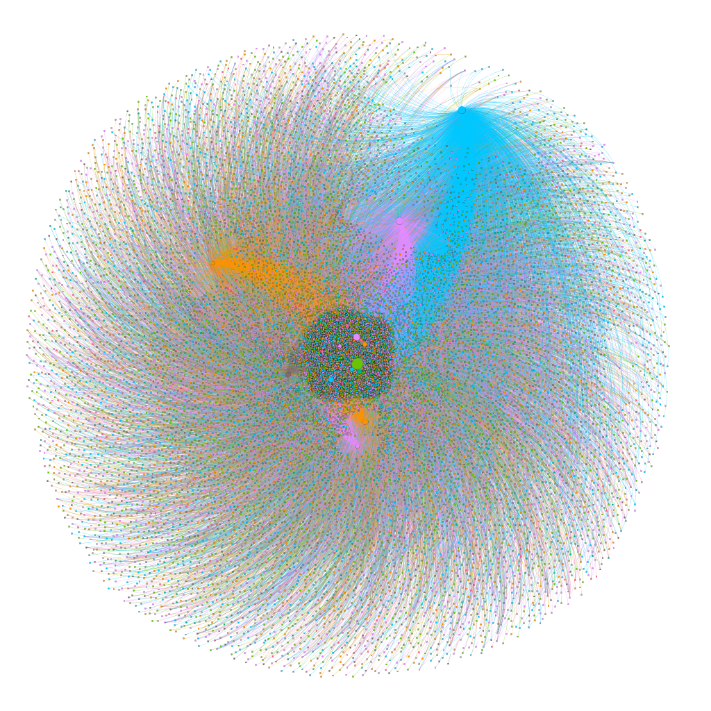

# Rede de Citações

As informações extraídas foram armazenadas em [dois diconários](https://github.com/anacwagner/scopus-scraping/tree/master/pickles), um contendo as informações de todos os artigos (`info_articles`) e outro contendo as informações de todos os periódicos (`info_journals`). A partir dessas estruturas, foi utilizado o [PyMongo](https://api.mongodb.com/python/current/) para montar a rede de citações. O resultado final encontra-se em [**var_cit_LOGIC.csv**](https://github.com/anacwagner/scopus-scraping/blob/master/outputs/var_cit_LOGIC.csv), que possui as seguintes colunas:

* SOURCE_A_ID
* SOURCE_A_YEAR
* SOURCE_J_ID
* TARGET_A_ID
* TARGET_A_YEAR
* TARGET_J_ID
* EDITIONS

Por exemplo, os dados da primeira linha são: 1,2008,1,1232,2003,1,12. Ou seja, o artigo com ID=1, publicado em 12/2008 pelo periódico da base de ID=1 , citou um artigo com ID=1232, publicado em 2003 pelo mesmo periódico em questão.

## Gephi
Com o intuito de tentar obter uma visualização utilizando o [Gephi](https://gephi.org), foi gerado o arquivo [**gephi_LOGIC.csv**](https://github.com/anacwagner/scopus-scraping/blob/master/outputs/gephi_LOGIC.csv) a partir do resultado anterior. O arquivo possui apenas duas colunas (um dos formatos lidos pelo Gephi).

* SOURCE
* TARGET

